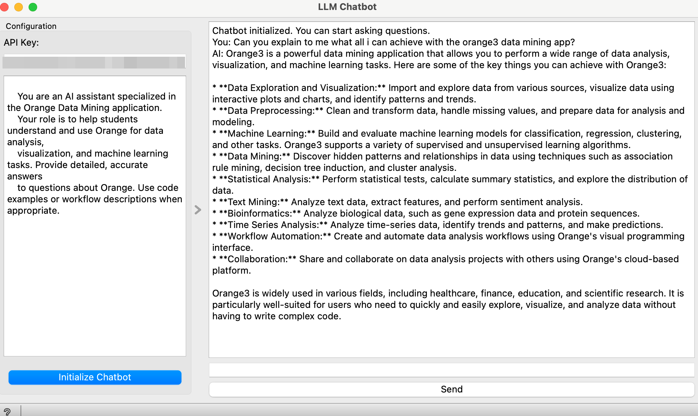

# LLM Chatbot Widget

The LLM Chatbot widget integrates Google's Generative AI to provide a chatbot interface within the Orange framework. Users can interact with the chatbot to ask questions about Orange Data Mining, receive guidance on data analysis, visualization, and machine learning tasks, and get assistance with the application.

## Parameters

### API Key
- **API Key**: The key required to authenticate requests to Google's Generative AI. This must be provided by the user to initialize the chatbot.

### System Prompt
- **System Prompt**: A customizable introductory message for the chatbot that defines its role and the type of assistance it should provide. The default prompt guides the chatbot to assist with questions about Orange Data Mining.

## Functionality

1. **Chatbot Initialization**:
   - **Initialize Chatbot**: Authenticates with Google's Generative AI using the provided API key and initializes the chatbot. The system prompt is sent to the chatbot to set the context.

2. **Message Sending**:
   - **Send Message**: Sends user-inputted messages to the chatbot and displays the responses in the chat display. The chatbot responds with text based on its training and context.

3. **System Prompt Management**:
   - **System Prompt Changed**: Updates the system prompt if modified by the user. The new prompt is sent to the chatbot to adjust its behavior and responses.

## Inputs
- **Data**: An `object` that can be used to provide context or information to the chatbot, such as details about the current dataset.

## Outputs
- **None**

