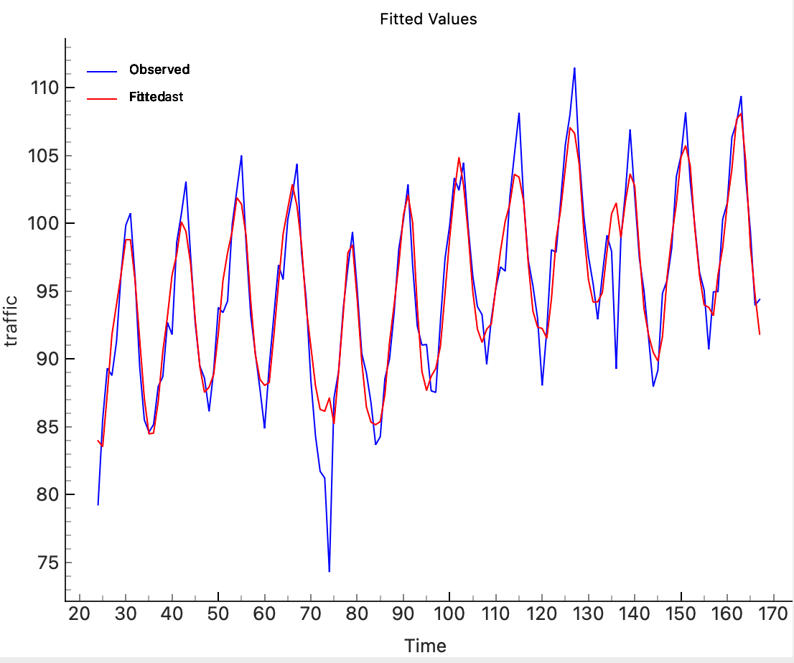

# LSTM Forecaster Widget

This widget allows the user to forecast time series data using an LSTM (Long Short-Term Memory) model. It provides various configurations for the LSTM model and visualizes the results of the predictions.

<figure>
  
  <figcaption>Widget Interface</figcaption>
</figure>

## Parameters
### LSTM Model Parameters
- **Target Variable**: Select the target variable (time series column) for forecasting.
- **Lookback**: The number of previous time steps to consider for predicting the next time step (default is 3).
- **LSTM Units**: Number of units (neurons) in the LSTM layers (default is 50).
- **Epochs**: Number of epochs to train the model (default is 100).
- **Batch Size**: Batch size used during training (default is 32).
- **Learning Rate**: Learning rate for the Adam optimizer (default is 0.001).

## Inputs
- **Time series**: Input time series data in the form of an Orange `Table`.

*Fitted Values*

*Forecast*

<figure>
  
  <figcaption>Model info</figcaption>
</figure>

## Outputs
- **Residuals**: Output table containing the residuals (errors) between the observed values and the model predictions.

