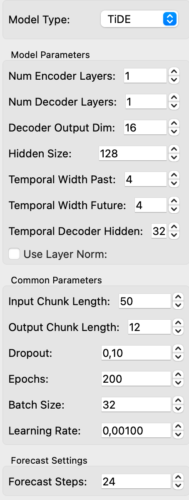
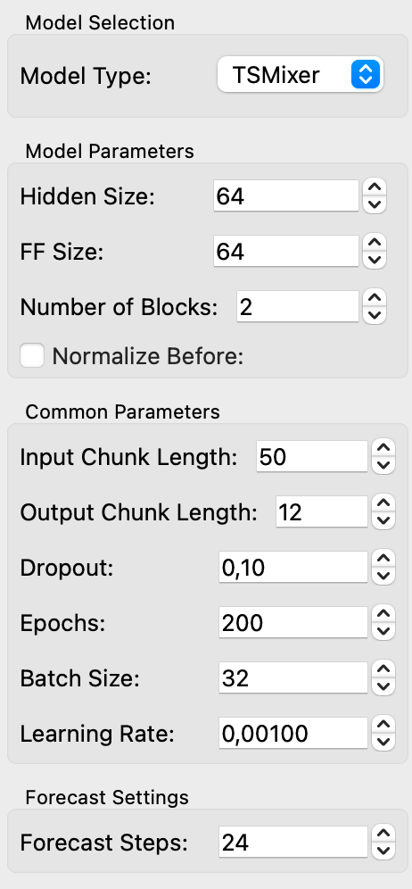

# Advanced MLP Models Widget

The `AdvancedTimeSeriesModels` widget allows users to train and evaluate advanced time series forecasting models, specifically the TiDE and TSMixer models, using the Darts library. This widget provides functionalities to select model parameters, train the model, and visualize the results.

## Parameters
### Common Settings

- **Input Chunk Length**: Length of the input sequence used for forecasting.
- **Output Chunk Length**: Length of the output sequence to predict.
- **Dropout**: Dropout rate used in the model to prevent overfitting.
- **Epochs**: Number of epochs for training the model.
- **Batch Size**: Batch size used during training.
- **Learning Rate**: Learning rate for the optimizer.
- **Forecast Steps**: Number of steps to forecast into the future.
- **Plot Type**: Type of plot to display ("Forecast" or "Fitted Values").

### TiDE-Specific Parameters

- **Num Encoder Layers**: Number of encoder layers in the TiDE model.
- **Num Decoder Layers**: Number of decoder layers in the TiDE model.
- **Decoder Output Dim**: Output dimension of the decoder.
- **Hidden Size**: Hidden layer size of the TiDE model.
- **Temporal Width Past**: Temporal width for past sequences.
- **Temporal Width Future**: Temporal width for future sequences.
- **Temporal Decoder Hidden**: Hidden size for temporal decoder.
- **Use Layer Norm**: Whether to use layer normalization.

<figure>
  
  <figcaption>TiDE Interface</figcaption>
</figure>

### TSMixer-Specific Parameters

- **Hidden Size Mixer**: Hidden size used in the TSMixer model.
- **FF Size**: Feedforward size in the TSMixer model.
- **Number of Blocks**: Number of blocks in the TSMixer model.
- **Normalize Before**: Whether to normalize inputs before feeding them to the model.

<figure>
  
  <figcaption>TSMixer Interface</figcaption>
</figure>

## Inputs

- **Time Series**: A table containing the time series data.

## Outputs

- **Residuals**: A table of residuals from the model predictions.
- **Forecast**: A table containing forecasted values.
