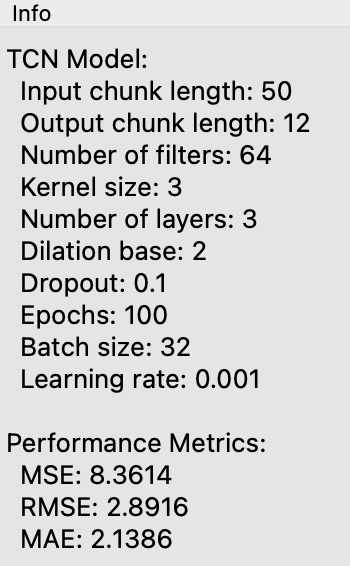

# TCN Forecaster Widget

This widget trains a Temporal Convolutional Network (TCN) model for time series forecasting using the Darts library. The widget allows users to configure TCN parameters and visualize the forecast and fitted values.

<figure>
  
  <figcaption>Widget Interface</figcaption>
</figure>

## Parameters
### TCN Model Parameters
- **Target Variable**: The variable (column) in the time series data to forecast.
- **Input Chunk Length**: Number of past observations used as input to predict the future (default is 50).
- **Output Chunk Length**: Number of future observations to predict (default is 12).
- **Number of Filters**: Number of filters in the TCN model (default is 64).
- **Kernel Size**: Size of the convolutional kernels (default is 3).
- **Number of Layers**: Number of layers in the TCN model (default is 3).
- **Dilation Base**: Dilation base for the convolutions (default is 2).
- **Dropout**: Dropout rate to prevent overfitting (default is 0.1).
- **Epochs**: Number of epochs to train the model (default is 100).
- **Batch Size**: Batch size used during training (default is 32).
- **Learning Rate**: Learning rate for the optimizer (default is 0.001).

## Inputs
- **Time series**: The input time series data in the form of an Orange `Table`.

*Fitted Values*

*Forecast*

<figure>
  
  <figcaption>Model info</figcaption>
</figure>

## Outputs
- **Residuals**: A table containing the residuals (forecast errors) between the observed and predicted values.
- **Forecast**: A table containing the forecasted values for future time steps.

