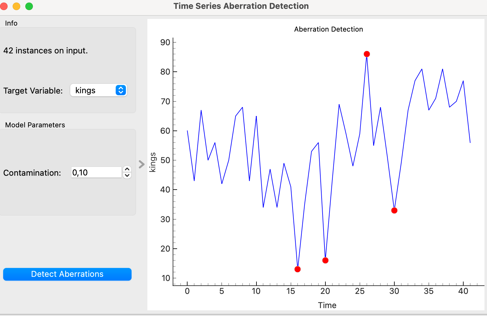

# Aberration Detection Widget

## Overview
The **Time Series Aberration Detection** widget identifies and visualizes aberrations (anomalies) in time series data. It utilizes the Isolation Forest algorithm to detect anomalies and plots the results for easy visualization.

## Parameters
- **contamination**: Proportion of outliers in the data. Determines the threshold for anomaly detection.
- **target_variable**: The time series variable in the data that will be analyzed for anomalies.

## Inputs
- **time_series**: A table of time series data (Orange.data.Table). This table should contain the time series data to be analyzed.

## Outputs
- **aberrations**: A table with detected aberrations (Orange.data.Table). Includes anomaly scores and labels.

