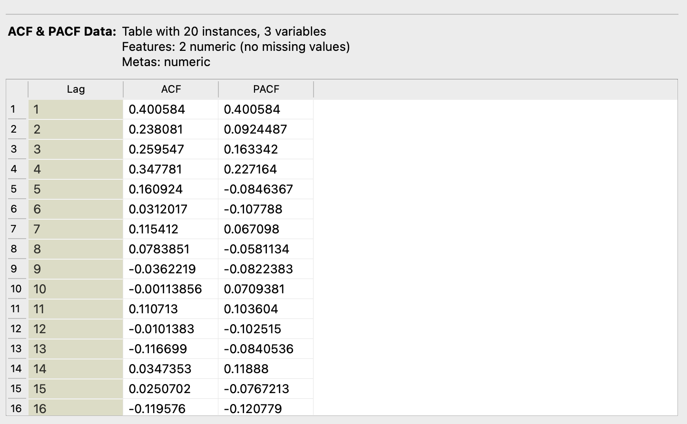

# ACF & PACF

## Overview
The ACF & PACF widget calculates and plots the Autocorrelation Function (ACF) and Partial Autocorrelation Function (PACF) of time series data. It helps in identifying the relationship between an observation and its lagged values.

## Parameters
- **max_lags**: The maximum number of lags for the ACF and PACF calculations.
> **Important:** Always set `max_lags` < 50% of input instances to ensure statistical reliability and computational stability.
- **target_variable**: The selected target variable for which the ACF and PACF are calculated.
- **significance_level**: The significance level for the confidence intervals. Default is 0.05 (5%).

## Inputs
- **Time series**: The input time series data (Orange.data.Table).

## Outputs
- **ACF & PACF Data**: A table containing the ACF and PACF values for the selected target variable.

