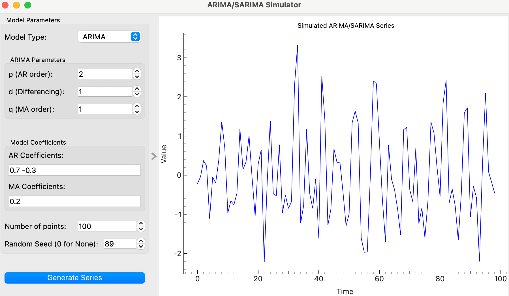

# ARIMA/SARIMA Simulator Widget

The ARIMA/SARIMA Simulator widget allows users to simulate time series data using ARIMA (AutoRegressive Integrated Moving Average) or SARIMA (Seasonal ARIMA) models. It provides a graphical interface for configuring model parameters and visualizing the generated time series.

## Parameters

### Model Type
- **Model Type**: Select between ARIMA (0) and SARIMA (1) models.

### ARIMA Parameters
- **p (AR order)**: The order of the AutoRegressive part of the model (default is 1).
- **d (Differencing)**: The number of differences needed to make the series stationary (default is 1).
- **q (MA order)**: The order of the Moving Average part of the model (default is 1).

### SARIMA Parameters (Visible only if SARIMA is selected)
- **P (Seasonal AR order)**: The order of the seasonal AutoRegressive part (default is 1).
- **D (Seasonal Differencing)**: The number of seasonal differences (default is 1).
- **Q (Seasonal MA order)**: The order of the seasonal Moving Average part (default is 1).
- **S (Seasonal Period)**: The number of periods in each seasonal cycle (default is 12).

### Model Coefficients
- **AR Coefficients**: Space-separated list of coefficients for the AutoRegressive part.
- **MA Coefficients**: Space-separated list of coefficients for the Moving Average part.
- **SAR Coefficients**: Space-separated list of seasonal AR coefficients (visible only if SARIMA is selected).
- **SMA Coefficients**: Space-separated list of seasonal MA coefficients (visible only if SARIMA is selected).

### Number of Points
- **Number of Points**: Number of data points to generate in the time series (default is 100).

### Random Seed
- **Random Seed**: Seed for random number generation. Set to 0 for no fixed seed (default is 0).

## Inputs
None

## Outputs
- **Simulated Data**: A table containing the simulated time series data.
