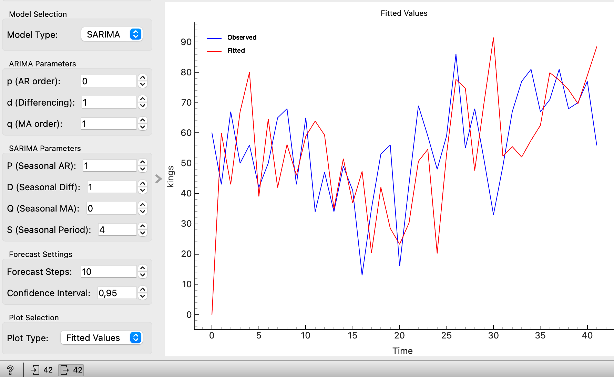
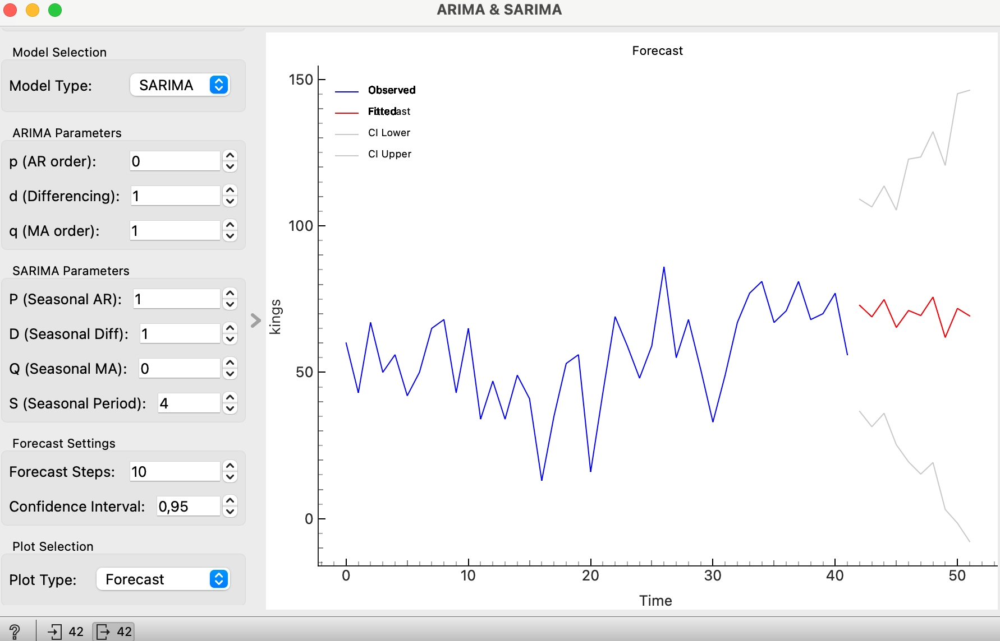
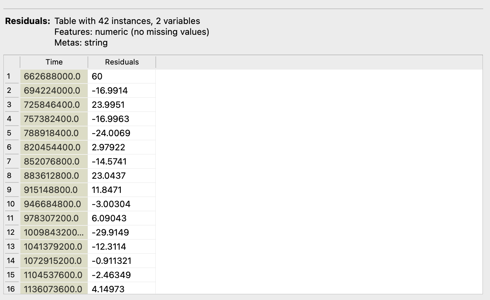
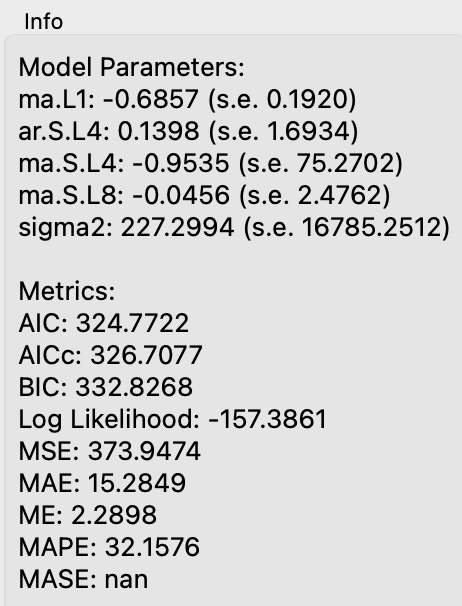

# ARIMA & SARIMA

## Overview
The ARIMA & SARIMA widget fits ARIMA or SARIMA models to time series data and visualizes the results. It allows users to specify model parameters and forecast future values or visualize fitted values.

## Parameters
- **model_type**: The type of model to fit (ARIMA / SARIMA).
- If the model type is ARIMA, the user can set:
  - **p**: The order of the autoregressive part of the model (AR).
  - **d**: The degree of differencing.
  - **q**: The order of the moving average part of the model (MA).
- If the model type is SARIMA, then the user can set **p, d, q** and also,
  - **P**: The order of the seasonal autoregressive part of the model (SAR).
  - **D**: The degree of seasonal differencing.
  - **Q**: The order of the seasonal moving average part of the model (SMA).
  - **S**: The length of the seasonal cycle.
- **forecast_steps**: The number of steps to forecast into the future.
- **confidence_interval**: The confidence interval for the forecast.
- **target_variable**: The selected target variable for modeling.
- **plot_type**: The type of plot to display (Forecast / Fitted Values).

## Inputs
- **Time series**: The input time series data (Orange.data.Table).

## Outputs
- **Residuals**: A table containing the residuals of the fitted model.

## GUI Elements
### Info Box
- Displays information about the fitted model, including model parameters and metrics.

### Model Metrics
The widget displays various metrics to evaluate the fitted model:
- **AIC (Akaike Information Criterion)**: A measure of model quality.
- **AICc (Corrected AIC)**: AIC adjusted for small sample sizes.
- **BIC (Bayesian Information Criterion)**: Another measure of model quality, penalizing complex models.
- **Log Likelihood**: The log of the likelihood function, indicating model fit.
- **MSE (Mean Squared Error)**: Average of the squared differences between observed and fitted values.
- **MAE (Mean Absolute Error)**: Average of the absolute differences between observed and fitted values.
- **ME (Mean Error)**: Average of the residuals.
- **MAPE (Mean Absolute Percentage Error)**: Average of the absolute percentage errors.
- **MASE (Mean Absolute Scaled Error)**: Scaled version of MAE for comparability across different datasets.

