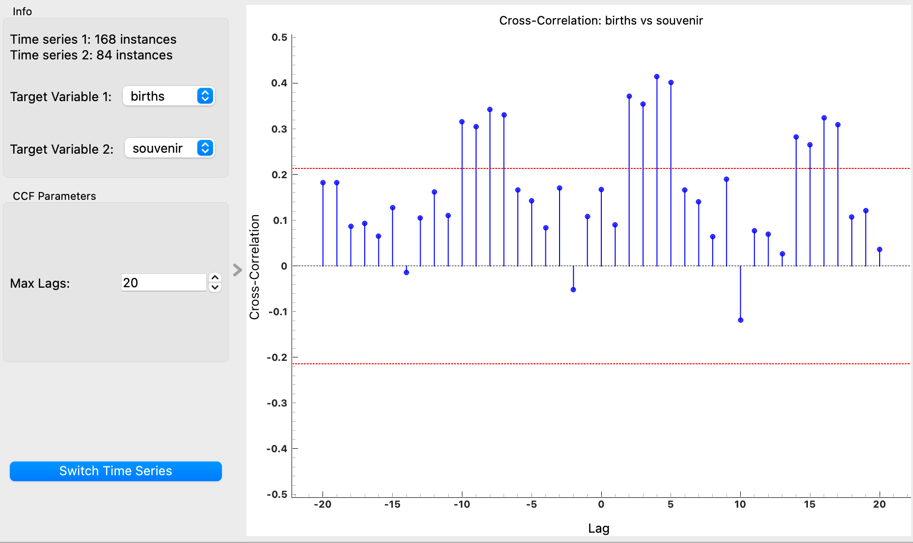

# Cross-Correlation Function Widget

## Overview
The **Cross-Correlation Function Widget** calculates and plots the cross-correlation of two time series. This analysis helps in understanding how one time series relates to another over different time lags.

## Parameters
- **max_lags**: The maximum number of lags to include in the cross-correlation plot. The default value is 30.
- **target_variable1**: The target variable from the first time series for which cross-correlation is computed.
- **target_variable2**: The target variable from the second time series for which cross-correlation is computed.

## Inputs
- **Time series 1**: The first time series data (Orange.data.Table).
- **Time series 2**: The second time series data (Orange.data.Table).

## Outputs
- **CCF Data**: The output table containing the computed cross-correlation values and corresponding lags.
