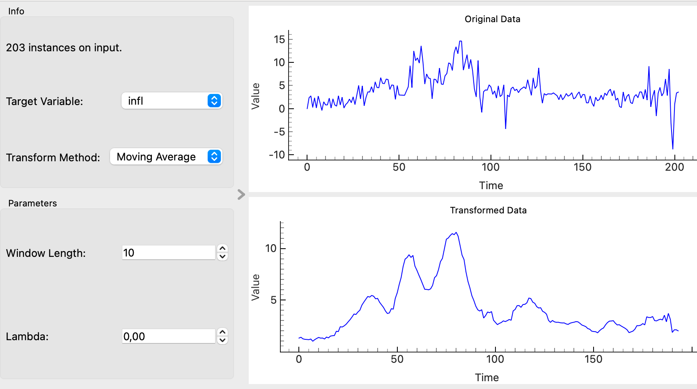

# Data Transforms

## Overview
The **Data Transforms** widget applies various transformations to time series data, including Moving Average, Box-Cox, and Log transformations. This allows for smoothing, stabilizing variance, or transforming data to better fit the assumptions of statistical models.

*Box-Cox Transform*

*Moving Average*

## Parameters
- **transform_method**: The transformation method to be applied. Options include:
  - **Moving Average**: Smooths the data using a moving average with a configurable window length.
  - **Box-Cox**: Applies the Box-Cox transformation to stabilize variance. The lambda parameter can be adjusted.
  - **Log**: Applies the logarithmic transformation to the data.
- **window_length**: The length of the moving average window. This parameter is used only when the Moving Average method is selected.
- **lambda_param**: The lambda parameter for the Box-Cox transformation. This parameter is used only when the Box-Cox method is selected.
- **target_variable**: The selected target variable to which the transformation will be applied.

## Inputs
- **Time series**: The input time series data (Orange.data.Table).

## Outputs
- **Transformed Data**: The output table containing the transformed time series data.

