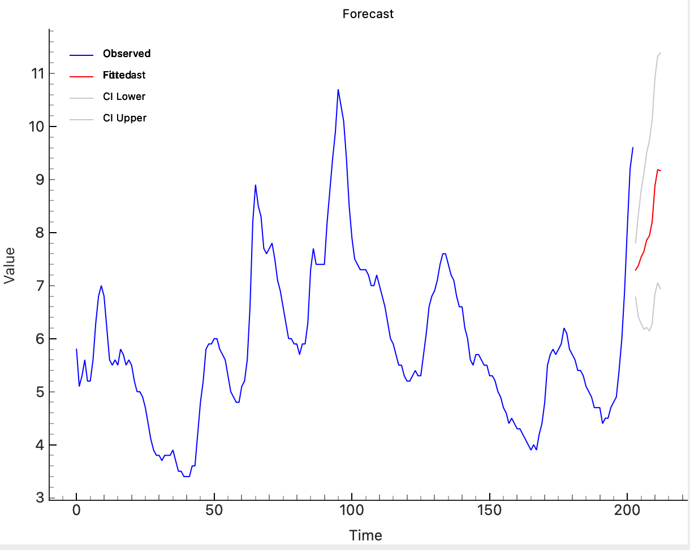
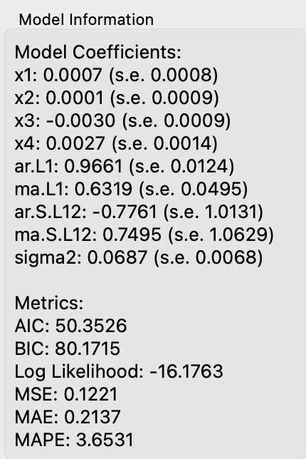

# Dynamic Regression

## Overview
The **Dynamic Regression** widget forecasts time series data using multiple exogenous variables with a Seasonal Autoregressive Integrated Moving Average with Exogenous Regressors (SARIMAX) model. This widget allows users to configure ARIMA and seasonal components, and it fits and forecasts based on input time series data.

<figure>

  <figcaption>Input options</figcaption>
</figure>

## Parameters
- **p**: The autoregressive order (AR component).
- **d**: The order of differencing.
- **q**: The moving average order (MA component).
- **P**: The seasonal autoregressive order.
- **D**: The seasonal differencing order.
- **Q**: The seasonal moving average order.
- **s**: The seasonal period (e.g., 12 for monthly data).
- **forecast_steps**: The number of periods to forecast.
- **confidence_interval**: The confidence interval for the forecast, expressed as a decimal (e.g., 0.95 for 95%).
- **plot_type**: The type of plot to display. Options include:
  - **0**: Forecast
  - **1**: Fitted Values

## Inputs
- **Target Variable**: The input target time series data (Orange.data.Table).
- **Exogenous Variables**: The input exogenous variables (Orange.data.Table) used as predictors.

*Fitted Values*

*Forecast*

<figure>

  <figcaption>Model Parameters</figcaption>
</figure>

## Outputs
- **Forecast**: The forecasted values for future periods (Orange.data.Table).
- **SARIMAX Model**: The fitted SARIMAX model object.
- **Residuals**: The residuals from the model fitting (Orange.data.Table).
