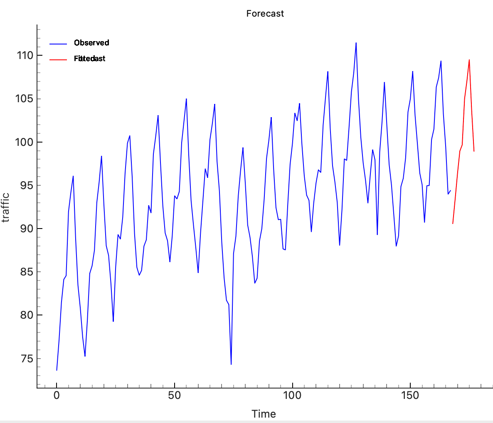

# ETS Model

## Overview
The **ETS Model** widget fits Error, Trend, Seasonal (ETS) models to time series data and visualizes the results. ETS models are useful for forecasting and understanding the components of time series data.

<figure>

  <figcaption>Input options</figcaption>
</figure>

## Parameters
- **target_variable**: The target variable to which the ETS model will be applied.
- **error_type**: The error type of the ETS model. Options include:
  - **add**: Additive error
  - **mul**: Multiplicative error
- **trend_type**: The trend type of the ETS model. Options include:
  - **add**: Additive trend
  - **mul**: Multiplicative trend
  - **none**: No trend
- **seasonal_type**: The seasonal type of the ETS model. Options include:
  - **add**: Additive seasonality
  - **mul**: Multiplicative seasonality
  - **none**: No seasonality
- **seasonal_period**: The number of periods in a seasonal cycle. This parameter is used only when a seasonal type is selected.
- **forecast_steps**: The number of future periods to forecast.
- **plot_type**: The type of plot to display. Options include:
  - **0**: Forecast
  - **1**: Fitted Values
- **damped_trend**: Whether to use a damped trend component in the model.

## Inputs
- **Time series**: The input time series data (Orange.data.Table).

*Fitted Values*

*Forecast*

<figure>

  <figcaption>Model Parameters</figcaption>
</figure>

## Outputs
- **Forecast**: The forecasted values for future periods (Orange.data.Table).
- **Fitted Values**: The fitted values of the model (Orange.data.Table).
- **Residuals**: The residuals from the model fitting (Orange.data.Table).

