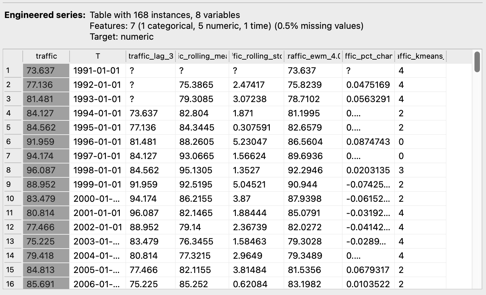

# Feature Engineering Widget

## Overview
The **Feature Engineering** widget is designed for creating new features from time series data. It provides functionality to apply various feature engineering techniques, such as lagging, rolling windows, exponential weighted means, percentage changes, and K-means clustering.

<figure>
  
  <figcaption>Widget Interface</figcaption>
</figure>

## Parameters
- **target_variable**: The variable in the time series data to which feature engineering techniques will be applied.
- **auto_apply**: Whether to automatically apply changes when the settings are modified. When enabled, changes are applied without needing to manually commit.

- **Add Features**:
   - Add different types of features to be created. Options include:
     - **Lag**: Creates a lagged version of the target variable.
     - **Rolling Window**: Computes rolling statistics (mean, standard deviation).
     - **EWM**: Computes exponentially weighted moving statistics.
     - **Percentage Change**: Computes percentage change from one observation to the next.
     - **K-means**: Applies K-means clustering to the target variable.

## Inputs
- **time_series**: A table of time series data (Orange.data.Table). This table should contain time series data where features will be engineered.

## Outputs
- **engineered_series**: A table of time series data with newly engineered features (Orange.data.Table).

*Outputs*
