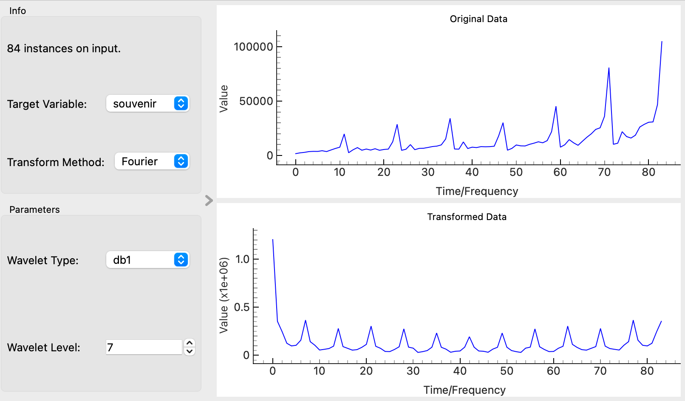

# Frequency Domain Transforms

## Overview
The **Frequency Domain Transforms** widget applies Fourier and Wavelet transforms to time series data. These transforms help analyze the frequency components of the data or decompose the data into different frequency bands.

*Fourier Transform*

*Wavelet Transform*

## Parameters
- **transform_method**: The method of transformation to be applied. Options include:
  - **Fourier**: Applies the Fourier transform to analyze frequency components.
  - **Wavelet**: Applies the Wavelet transform to decompose the data into different frequency bands.
- **wavelet_type**: The type of wavelet to use for the Wavelet transform. Options include:
  - `haar`, `db1`, `db2`, `db3`, `sym2`, `sym3`, `coif1`, `coif2`
- **wavelet_level**: The level of decomposition for the Wavelet transform. This parameter is used only when the Wavelet method is selected.
- **target_variable**: The selected target variable to which the transform will be applied.

## Inputs
- **Time series**: The input time series data (Orange.data.Table).

## Outputs
- **Transformed Data**: The output table containing the transformed time series data.
