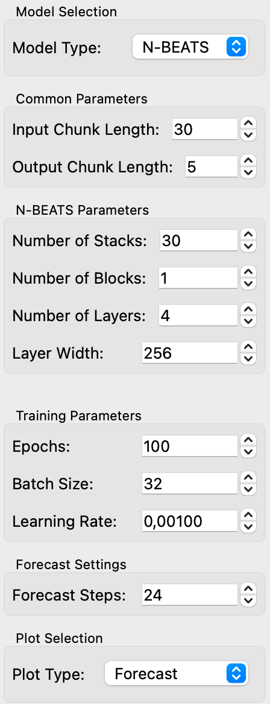
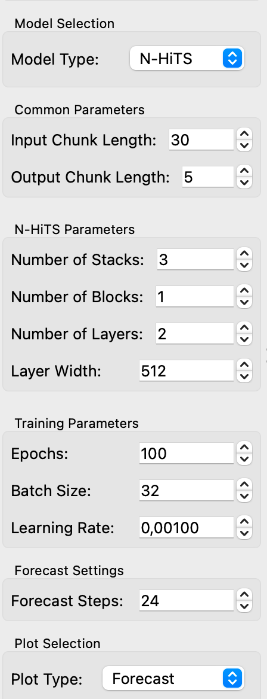
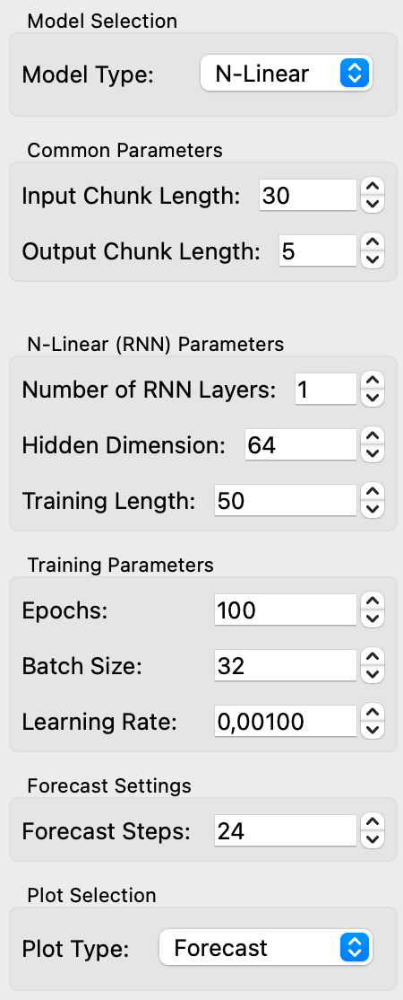

# Neural Forecasting Models Widget

`Neural Forecasting Models` is an Orange widget designed to train and forecast time series data using neural network models from the Darts library. This widget allows you to select and configure three neural forecasting models: N-BEATS, N-HiTS, and N-Linear (RNN), and visualize the results. You can input a time series, set model-specific parameters, and obtain forecasts and residuals as outputs.

## Parameters

### Common Settings
- **Target Variable**: Choose the continuous variable from the input time series to use as the target for forecasting.
- **Model Type**: Select the type of neural network model for forecasting:
  - `N-BEATS`
  - `N-HiTS`
  - `N-Linear (RNN)`
- **Input Chunk Length**: The number of previous time steps (look-back period) used as input to the model.
- **Output Chunk Length**: The number of future time steps that the model will predict in one forecast.
- **Forecast Steps**: Number of time steps for the forecast.

### N-BEATS Model Parameters
- **Number of Stacks**: The number of stacks in the N-BEATS model.
- **Number of Blocks**: The number of blocks per stack.
- **Number of Layers**: The number of fully connected layers per block.
- **Layer Width**: The width of the fully connected layers.

<figure>
  
  <figcaption>N-BEATS Interface</figcaption>
</figure>

### N-HiTS Model Parameters
- **Number of Stacks**: The number of stacks in the N-HiTS model.
- **Number of Blocks**: The number of blocks per stack.
- **Number of Layers**: The number of fully connected layers per block.
- **Layer Width**: The width of the fully connected layers.

<figure>
  
  <figcaption>N-HiTS Interface</figcaption>
</figure>

### N-Linear (RNN) Model Parameters
- **Number of RNN Layers**: The number of RNN layers in the model.
- **Hidden Dimension**: The dimensionality of the hidden state of the RNN.
- **Training Length**: The length of the training sequence (look-back period) for the RNN.

<figure>
  
  <figcaption>N-Linear Interface</figcaption>
</figure>

### Training Settings
- **Epochs**: Number of training epochs.
- **Batch Size**: The size of each training batch.
- **Learning Rate**: The learning rate for the optimizer.

## Inputs

### Time Series (Input)
- **Type**: `Orange.data.Table`
- **Description**: Time series data containing continuous variables. The user can select which continuous variable to forecast. 

## Outputs

### Residuals (Output)
- **Type**: `Orange.data.Table`
- **Description**: The residuals (errors) between the observed and predicted values of the input time series.

### Forecast (Output)
- **Type**: `Orange.data.Table`
- **Description**: The forecasted values for the input time series over the specified forecast horizon.

