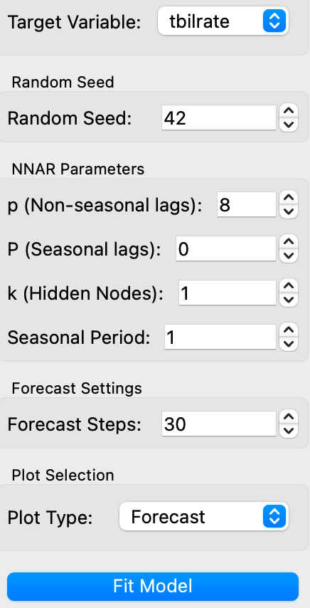

# **NNAR Model Widget**

## **Overview**
The **NNAR Model** widget fits a Neural Network AutoRegression (NNAR) model to time series data and visualizes the resulting forecasts, fitted values, and residuals. This widget allows users to configure the NNAR model's parameters and output the forecast results for further analysis.

<figure>
  
  <figcaption>Widget Interface</figcaption>
</figure>

## **Parameters**
- **p**: The number of lagged inputs (non-seasonal).
- **P**: The number of seasonal lagged inputs.
- **k**: The number of nodes in the hidden layer.
- **forecast_steps**: The number of steps to forecast into the future.
- **random_seed**: The random seed used for reproducibility.
- **seasonal_period**: The period of seasonality (e.g., monthly data would use 12).

## **Inputs**
- **time_series**: A time series dataset (Orange.data.Table) to fit the NNAR model. The dataset should include a target variable for the model to predict.

*Fitted values*

*Forecast*

<figure>
  
  <figcaption>Model info</figcaption>
</figure>

## **Outputs**
- **forecast**: A table containing the forecasted values.
- **fitted_values**: A table of the fitted values produced by the NNAR model.
- **residuals**: A table of the residuals, which are the differences between the observed and fitted values.
