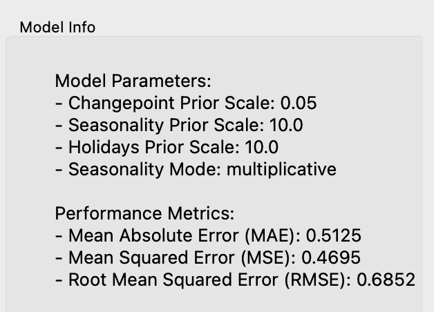

# Prophet Forecaster Widget Documentation

## Overview
The **Prophet Forecaster** widget allows users to forecast time series data using Facebook Prophet. This widget is designed for handling temporal data, predicting future values, and visualizing the results.

<figure>
  
  <figcaption>Widget Interface</figcaption>
</figure>

## Parameters

- **target_variable**: Select the target variable from the input time series data.
- **start_date**: The start date for the time series in `YYYY-MM-DD` format.
- **frequency**: The frequency of the time series (Daily, Weekly, Monthly, etc.).
- **forecast_periods**: The number of periods to forecast into the future.

### Prophet Parameters
- **changepoint_prior_scale**: Adjusts the flexibility of the trend by controlling the size of the changepoints.
- **seasonality_prior_scale**: Controls the flexibility of the seasonal components.
- **holidays_prior_scale**: Adjusts the impact of holidays on the forecast.
- **seasonality_mode**: Choose between "additive" and "multiplicative" seasonality.

## Inputs

- **Time Series**: Input time series data (Orange.data.Table) with a continuous target variable and an optional time variable.

*Forecast*

<figure>
  
  <figcaption>Model Info</figcaption>
</figure>

## Outputs

- **Forecast**: The widget outputs a forecasted time series (Orange.data.Table) containing the original values, predicted values (`yhat`), and confidence intervals (`yhat_lower`, `yhat_upper`).

