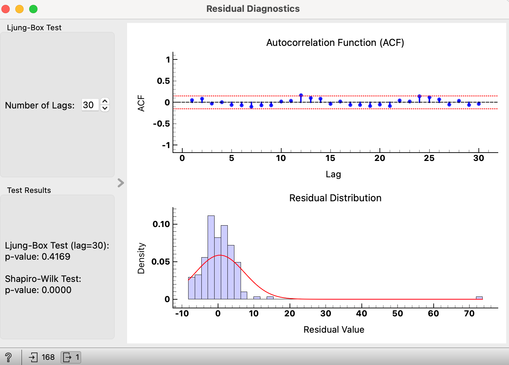
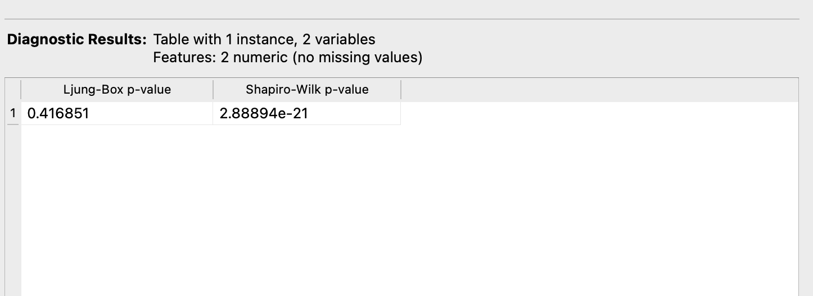

# Residual Diagnostics Widget

## Overview

The **Residual Diagnostics** widget performs the Ljung-Box and Shapiro-Wilk tests on residuals to diagnose their properties. It visualizes the autocorrelation function (ACF) and the distribution of residuals, allowing users to assess the randomness and normality of the residuals. 

## Inputs and Outputs

### Inputs

- **Residuals**: The residuals from a time series model provided as an Orange `Table`.

### Outputs

- **Diagnostic Results**: The results of the Ljung-Box and Shapiro-Wilk tests provided as an Orange `Table`.

## Settings

- **Number of Lags**: The number of lags to use in the Ljung-Box test.

### Test Results

An information box that displays the p-values from the Ljung-Box and Shapiro-Wilk tests.
