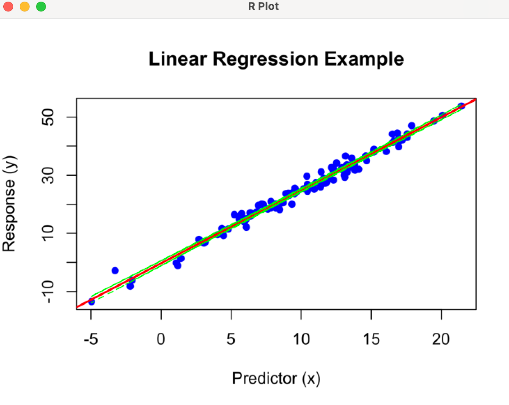

# R Script Widget

The OWRScript widget allows users to run R scripts within the Orange framework. It supports executing R code, manipulating data, and visualizing results using R's powerful statistical and graphical capabilities. The widget also provides a script library for saving and managing R scripts.

*Widget interface*

*Example visualization*

## Functionality

1. **Script Library Management**:
   - **Add Script**: Allows users to add a new R script to the library with a user-defined name.
   - **Remove Script**: Allows users to remove the selected R script from the library. At least one script must remain in the library.
   - **Update Script**: Updates the currently selected script in the library with the text from the editor.

2. **Script Execution**:
   - **Run Script**: Executes the R script on the input data. The widget converts the data to an R dataframe, runs the script, and processes the output.

3. **Data Conversion**:
   - **`orange_to_r(data)`**: Converts Orange `Table` or `Timeseries` data to an R dataframe.
   - **`r_to_orange(r_df)`**: Converts an R dataframe back to an Orange `Table`.

4. **Output Handling**:
   - **Visualization**: Creates and displays a plot from the R script if the script generates a graphical output. The plot is shown in a new window.
   - **Data Output**: Sends the output data from the R script (if it's a dataframe) to the widget’s output.

## Inputs
- **Data**: An Orange `Table` object which serves as the input data for the R script, if applicable

## Outputs
- **Data**: An Orange `Table` object containing the output data from the R script, if applicable.

