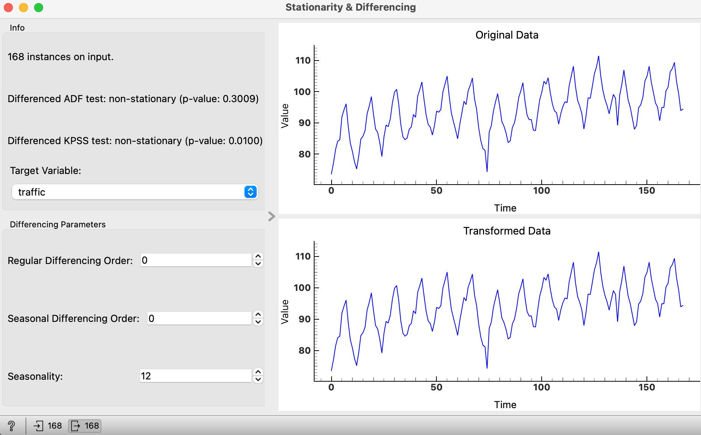
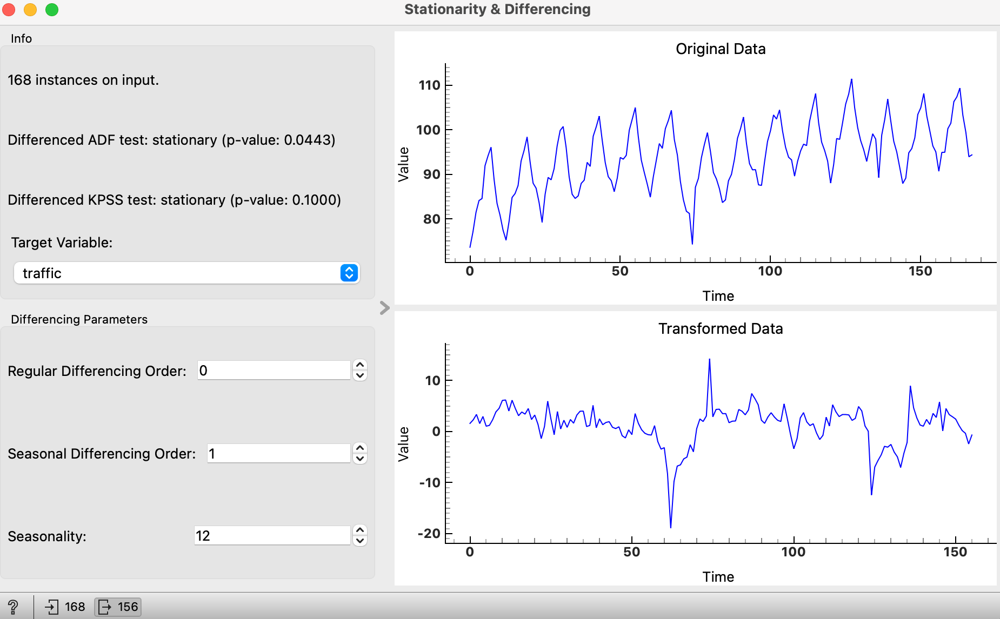

# Stationarity & Differencing Widget

## Overview

The **Stationarity & Differencing** widget visualizes and applies differencing to time series data to achieve stationarity. It allows users to input a time series dataset, select a target variable, specify differencing parameters, and visualize both the original and differenced data. Additionally, it performs stationarity tests (ADF and KPSS) on the original and differenced data.

## Inputs and Outputs

### Inputs

- **Time Series**: The time series data to be analyzed and differenced. This should be provided as an Orange `Table`.

### Outputs

- **Differenced Data**: The differenced time series data as an Orange `Table`.

## Settings

- **Target Variable**: The variable in the dataset to be differenced.
- **Regular Differencing Order**: The order of regular differencing to apply.
- **Seasonal Differencing Order**: The order of seasonal differencing to apply.
- **Seasonality**: The period of seasonality in the time series.

## User Interface

### Info Box

The Info Box displays information about the input data and results of the stationarity tests. 
It performs the Augmented Dickey-Fuller (ADF) and Kwiatkowski-Phillips-Schmidt-Shin (KPSS) tests on the original (initially) and differenced data to check for stationarity and displays the p-value.
