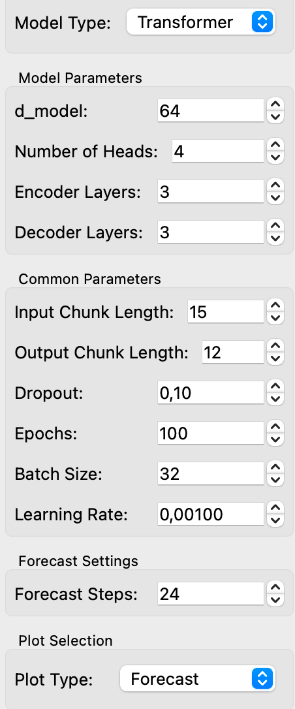
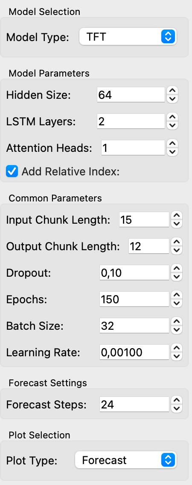

# Transformer Models Widget

The **Transformers** widget provides functionality to train Transformer and TFT models for time series forecasting using the Darts library. It allows the user to select between two model types (Transformer or TFT), configure model parameters, and visualize the forecasted and fitted values. The widget also outputs residuals and forecasted values as Orange tables.

## Parameters
### Model Type
- **Transformer**: Default option for time series forecasting. Transformer models are suitable for a variety of tasks and offer flexibility in handling time series data. Its key innovation lies in its use of the self-attention mechanism.
- **TFT (Temporal Fusion Transformer)**: The Temporal Fusion Transformer (TFT) is a specialized architecture designed specifically for multi-horizon time series forecasting. It combines several advanced techniques to capture both short-term and long-term temporal patterns while also handling static and time-varying covariates effectively.

### Common Parameters
- **Input Chunk Length**: Length of the input sequence (number of previous time steps) to be used by the model for making predictions.
- **Output Chunk Length**: Length of the output sequence (number of future time steps) that the model should predict.
- **Dropout**: Regularization parameter that helps prevent overfitting by randomly dropping units during training.
- **Epochs**: Number of training epochs. An epoch represents one complete pass over the training data.
- **Batch Size**: Number of time series examples in each batch during training.
- **Learning Rate**: Controls the step size of the optimization process. Lower values lead to slower training but can improve convergence.
- **Forecast Steps**: Number of time steps to forecast into the future.

### Transformer Model Parameters
- **d_model**: Dimension of the model's internal representations.
- **Number of Heads**: Number of attention heads in the multi-head attention mechanism.
- **Encoder Layers**: Number of layers in the encoder part of the Transformer model.
- **Decoder Layers**: Number of layers in the decoder part of the Transformer model.

<figure>
  
  <figcaption>Transformer Interface</figcaption>
</figure>

### TFT Model Parameters
- **Hidden Size**: Dimension of the hidden layers in the TFT model.
- **LSTM Layers**: Number of LSTM layers used in the TFT model.
- **Attention Heads**: Number of attention heads in the TFT model.
- **Add Relative Index**: Whether to include a relative index (position) feature in the model. (Must be enabled)

<figure>
  
  <figcaption>TFT Interface</figcaption>
</figure>

## Inputs

- **Time Series**: Expects a time series input in the form of an Orange `Table`. The table should have at least one continuous variable representing the target time series.

## Outputs

- **Residuals**: Outputs the residuals (difference between observed and predicted values) as an Orange `Table`.
- **Forecast**: Outputs the forecasted values for the specified forecast steps as an Orange `Table`.

