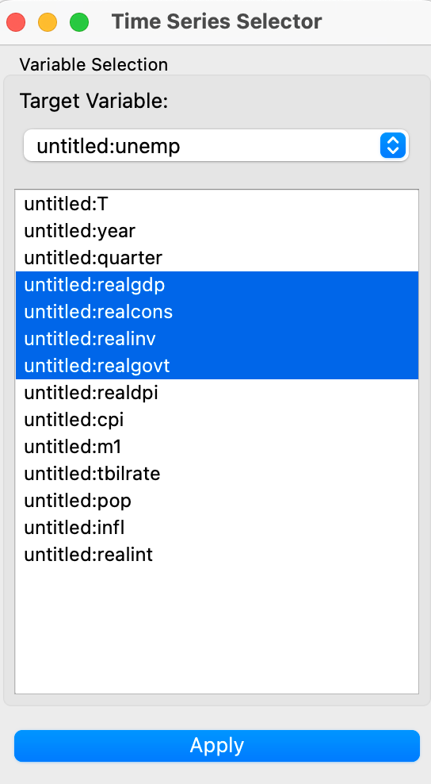
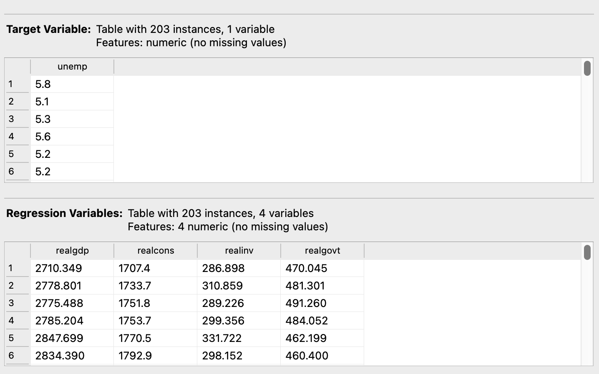

# Variable Selector

## Overview
The **Variable Selector** widget allows you to select target and exogenous variables from multiple time series data sources. It is designed to handle multiple input datasets and enables users to configure which variables to use as target and which to treat as exogenous.

<figure>
  
  <figcaption>Selection Interface</figcaption>
</figure>

*Selection Output*

## Parameters
- **target_variable**: The selected target variable. This is the variable that the model will predict or analyze.
- **regression_variables**: The list of exogenous variables. These variables are used as predictors in the model.

## Inputs
- **Time Series Data**: The input time series data (Orange.data.Table). The widget can accept multiple time series datasets.

## Outputs
- **Target Variable**: The selected target variable (Orange.data.Table).
- **Exogenous Variables**: The selected exogenous variables (Orange.data.Table).

