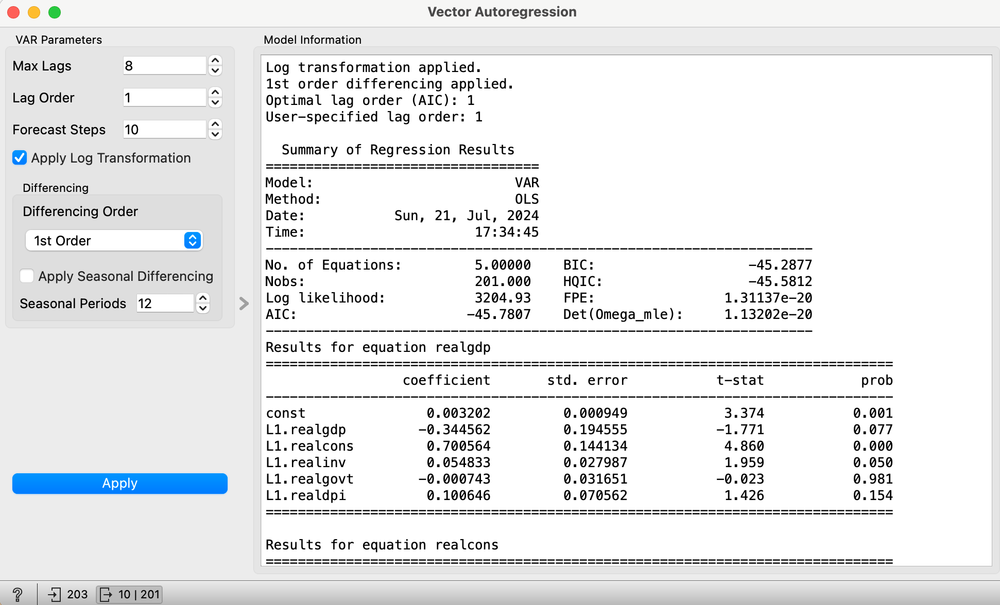
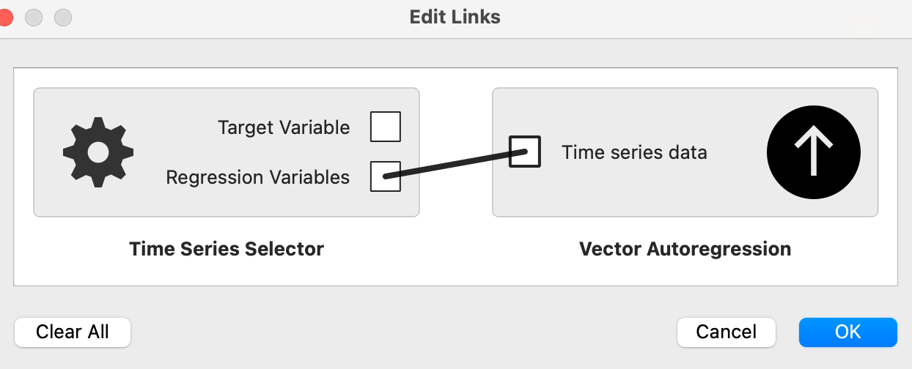

# Vector AutoRegression Widget

## Description
The `VAR Widget` performs Vector Autoregression (VAR) modeling and forecasting on multivariate time series data. It provides options for data transformation (log transform), finite differencing, and seasonal differencing (both 1st order and 2nd order) to ensure stationarity before fitting the VAR model. The widget also outputs the forecasted values, residuals, and a detailed model summary.

## Inputs
- **Time series data**: A multivariate time series data in the form of an Orange `Table`. The input regression variables must be fed using the `Time Series Selector Widget` where you can select multiple regression variables. There is no need to select a target variable in the `Time Series Selector Widget` when choosing the variables for the `VAR Wisget`. 

## Outputs
- **Forecast**: Forecasted values as an Orange `Table`.
- **Residuals**: Residuals from the fitted VAR model as an Orange `Table`.

## Parameters
- **Max Lags**: The maximum number of lags to consider for the VAR model.
- **Lag Order**: The lag order to use for the VAR model.
- **Forecast Steps**: The number of steps to forecast.
- **Apply Log Transformation**: Whether to apply a log transformation to the data.
- **Differencing Order**: The order of differencing to apply (No Differencing, 1st Order, or 2nd Order).
- **Apply Seasonal Differencing**: Whether to apply seasonal differencing.
- **Seasonal Periods**: The number of periods to use for seasonal differencing.

## GUI Components
1. **VAR Parameters**: A box containing parameters for VAR modeling.
    - **Max Lags**: Spin box to select the maximum number of lags.
    - **Lag Order**: Spin box to select the lag order.
    - **Forecast Steps**: Spin box to select the number of forecast steps.
    - **Apply Log Transformation**: Checkbox to apply log transformation.
2. **Differencing**: A nested box within VAR Parameters for differencing settings.
    - **Differencing Order**: Combo box to select the order of differencing.
    - **Apply Seasonal Differencing**: Checkbox to apply seasonal differencing.
    - **Seasonal Periods**: Spin box to select the number of periods for seasonal differencing.
3. **Apply Button**: Button to apply the selected parameters and run the VAR model.
4. **Model Information**: A text area to display the model summary and diagnostic information.

## Main Area Information
The main area of the widget displays deatiled information about the fitted VAR model and its diagnostics. The following details are included:

1. **Transformation Information**: 
    - Indicates whether log transformation or differencing (including seasonal differencing) has been applied to the data.

2. **Optimal Lag Order**: 
    - Displays the optimal lag order selected based on the Akaike Information Criterion (AIC).

3. **User-Specified Lag Order**: 
    - Shows the lag order specified by the user for fitting the VAR model.

4. **Model Summary**: 
    - Provides a detailed summary of the fitted VAR model, including coefficients, standard errors, t-statistics, and p-values.

5. **VAR Equations**: 
    - Lists the equations representing the VAR model, detailing the relationship between variables with their respective coefficients.

6. **Optimal Lag Information**: 
    - Presents additional criteria for lag order selection, such as Bayesian Information Criterion (BIC), Final Prediction Error (FPE), and Hannan-Quinn Information Criterion (HQIC).

7. **Stationarity Test Results**: 
    - Reports the results of the Augmented Dickey-Fuller (ADF) test for each variable, indicating whether the time series is stationary. Includes ADF statistics, p-values, and critical values.

## Error Handling
If an error occurs during model fitting or data processing, the error message and traceback will be displayed in the model information text area, and no outputs will be sent.

